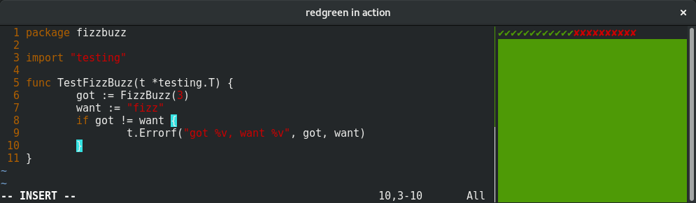

# redgreen

This is a simple tool to execute tests and show a red or green background in a
terminal. It is meant to be used in TDD sessions in a Coding Dojo.



## Installation

You will need to [install](https://golang.org/doc/install) the
[Go](https://golang.org/) tools to compile `redgreen` from source.
Next, use the `go` tool to download, compile and install `redgreen`:

```console
$ go get github.com/rhcarvalho/redgreen
```

## Usage

The main purpose of `redgreen` is to show a red background color when tests fail
and green when they pass.

By default, starting `redgreen` will run `go test` in the current directory and
will rerun the test command every time a file changes, updating the background
color accordingly.

You can specify a different test command by passing positional arguments:

```console
$ redgreen go test
$ redgreen nosetests
$ redgreen rake test
```

It is recommend to run `redgreen` in a small terminal window configured as
*Always on Top*. For example, on GNOME Terminal, right-click anywhere in the
middle of the terminal screen and uncheck the box *Show Menubar*, then click on
the window title bar and choose *Always on Top*. Resize the window to a small
size and drag it to a corner where it doesn't bother the view to your code
editor.

If you are a `tmux` user you can split your terminal and see code and test
status in a single window, like the screenshot above:

```console
$ tmux new-session \; set status off \; split-window -hp 20 redgreen \; last-pane
```

You can use any other way to split your terminal window or organize your windows
to add `redgreen` to your testing flow.

To stop `redgreen` and **exit**, press the `Esc` key.
